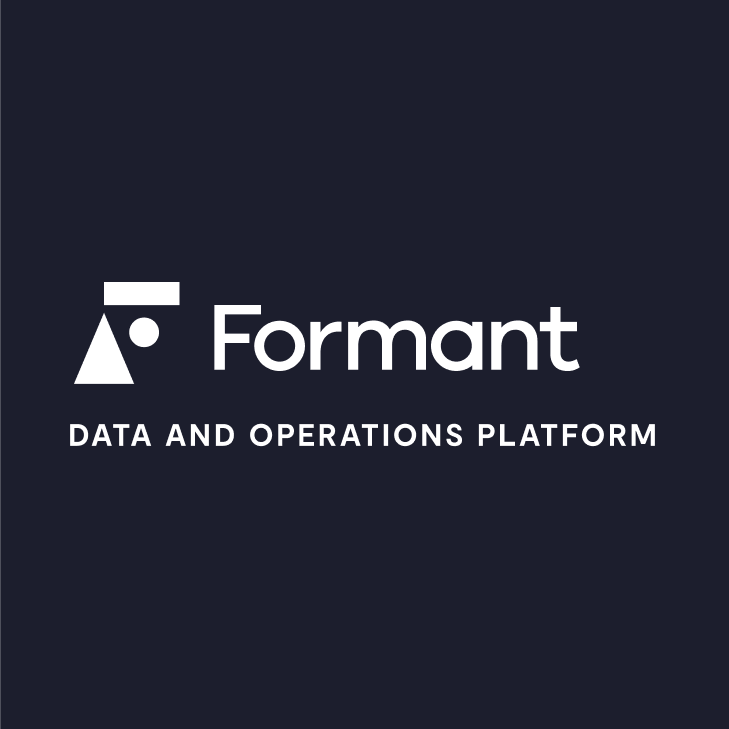
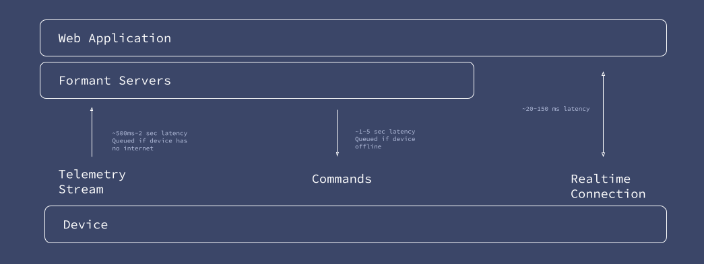
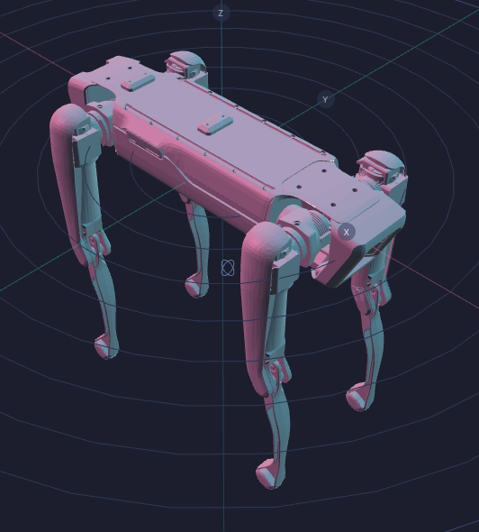
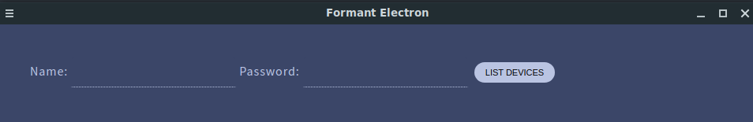
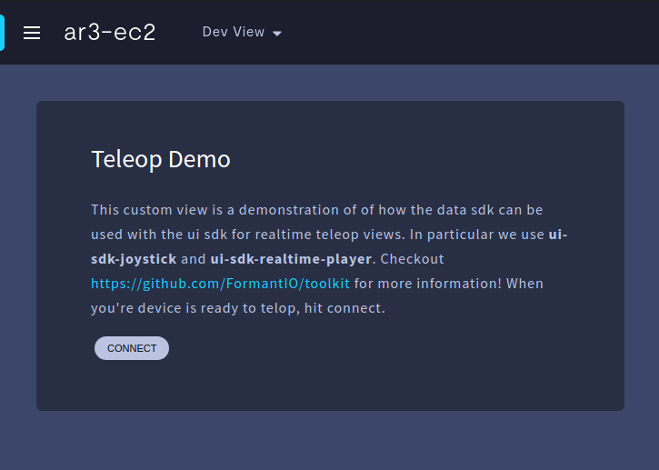

<p align="center">
  <a href="https://formant.io" target="_blank" rel="noopener"></a>
</p>

<h3 align="center">
  <a href="#about">About</a> &nbsp;·&nbsp;
  <a href="#data">Data</a> &nbsp;·&nbsp;
  <a href="#faq">FAQ</a> &nbsp;·&nbsp;
  <a href="#partners">Partners</a>
</h3>
<br>

A collection of open source libraries to help build your custom robot platform on top of Formant APIs.

<h2 align="center">About</h2>

With this repo's tools you can make custom web and 3D experiences on top of Formant using [ThreeJS](https://threejs.org/), get information about your fleet of devices, create realtime visualizations of your robots, and more.

- Embed your own application in Formant
- Create your own application that uses Formant's APIs and RealtimeSDK for data
- Create WebView's for mobile applications that show 3D visualization of your fleet

# Documentation

- [HTTP API](https://formantio.github.io/toolkit/docs/api/)
- [Data SDK](https://formantio.github.io/toolkit/docs/data-sdk/)

# How does it work?

We understand you want complete control over your user experience, so Formant provides:

- A Data SDK to get realtime and historical data
- Simple 3D elements that you can import into your ThreeJS scene
- UI custom elements to make your application visually look similar to Formant's ecosystem

# What do you have for ThreeJS?

## three-formant-urdf

This ThreeJS element will show a URDF of a robot using the zipped URDF uploaded for formant and control it's joint states in realtime.

<h2 align="center">Data</h2>

<p align="center">
  
</p>

<h2 align="center">FAQ</h2>

## How do I get data?

This depends on the type of app you're making

### I'm making an application outside of formant

Using user login credentials or service accounts, you can use the Data SDK to get access to device data.

```javascript
import { Authentication, Fleet } from "@formant/data-sdk";

await Authentication.login("sam@robot.xyz", "12345");

// Get all devices
const allDevices = await Fleet.getDevices();

// find the device(s) you want
const device = allDevices.find((d) => d.name === "spot");

// Get data ...
const data = await device.getLatestTelemetry();
```

### I'm making an application within Formant as a custom view

The Data SDK will be able to figure out from url the authentication needed to access the current viewing device.

```javascript
import { Authentication, Fleet } from "@formant/data-sdk";

await Authentication.waitTilAuthenticated();

// Get the context of a device is passed along as a query string
const device = await Fleet.getCurrentDevice();

// Get data ...
const data = await device.getLatestTelemetry();
```

## I don't want to use these libraries, how do I use the HTTP API?

If your just interested in using our [APIs](https://formantio.github.io/toolkit/docs/api/#overview), there's two main steps

### 1) Get an authorization token

```javascript
await fetch("https://api.formant.io/v1/admin/auth/login", {
  method: "POST",
  body: JSON.stringify({{email:"sam@robot.xyz", password:"12345"}}),
  headers: {
    "Content-Type": "application/json"
  }
});
```

```console
curl -X POST "https://api.formant.io/v1/admin/auth/login" \
 -H "Accept: application/json" \
 -H "Content-Type: application/json" \
 -d '{"email":"sam@robot.xyz","password":"12345"}'
```

This will return a [JWT](https://jwt.io) token.

```javascript
{
   "authentication":{
      "accessToken": "abc......xyz",
      ...
    },
    ...
}
```

### 2) Call an API with the token

```javascript
// the token from above
cons token = "abc......xyz"

await fetch("https://api.formant.io/v1/admin/device-details/query", {
  method: "POST",
  body: JSON.stringify({{enabled:true, type:"default"}}),
  headers: {
    "Content-Type": "application/json",
    "Authorization: "Bearer "+token
  }
});
```

```console
curl -X POST "https://api.formant.io/v1/admin/device-details/query" \
 -H "Accept: application/json" \
 -H "Content-Type: application/json" \
 -H "Authorization: Bearer abc......xyz" \
 -d '{"enabled":true,"type":"default"}'
```

## I don't want to use WebPack/Vite, can I just use plain JavaScript?

Yes, you can do it in two ways, first as an ES6 module:

```html
<script type="module">
  import {
    Authentication,
    Fleet,
  } from "https://cdn.jsdelivr.net/npm/@formant/data-sdk/dist/data-sdk.es6.js";
  await Authentication.waitTilAuthenticated();
  const devices = await Fleet.getDevices();
  window.document.body.innerHTML = devices.map((_) => _.name).join("<br>");
</script>
```

or as a non-module:

```html
<script src="https://cdn.jsdelivr.net/npm/@formant/data-sdk/dist/data-sdk.umd.js"></script>
<script type="module">
  const { Authentication, Fleet } = window.FormantDataSDK;
  await Authentication.waitTilAuthenticated();
  const device = await Fleet.getCurrentDevice();
  window.document.body.innerHTML = JSON.stringify(
    await device.getLatestTelemetry()
  );
</script>
```

## How do I take a URDF and convert it into a zip for Formant?

<p align="center">
  
</p>

To prepare a URDF for the web, you must collect the .urdf file from ROS. You will be consructing a zip that contains the:

- urdf in the root folder
- meshes referenced by the urdf

Currently formant only supports `.dae` models. You can easily convert models using `ctmconv`.

Install using ubuntu:

```
apt-get install openctm-tools
```

```
ctmconv leg.stl leg.dae
```

An example zip layout will look like

- my_arm.zip
  - my_arm.urdf
  - meshes/
    - arm1.dae
    - arm2.dae

It's important that your meshes be referenced by relative links. **Remove absolute paths that start with "package://"**.

```
<mesh filename="meshes/base_link.dae" />
```

## Can I make an electron app?

Yep, checkout the [example](https://github.com/FormantIO/toolkit/tree/master/examples/simple-electron).

<p align="center">
  
</p>

## Can I make a custom realtime data channel to my device?

```javascript
await device.startRealtimeConnection();
const j = await device.createCustomDataChannel("joystick");
await j.waitTilReady();
j.send("konami");
j.addListener((message) => {
 console.log(message);
});
```

## Is there a simple way to get a Formant look and feel?

When building an embedded app, you might want a quick way to get a website that looks like Formant.

<p align="center">
  
</p>

```html
<link
  rel="stylesheet"
  href="https://cdn.jsdelivr.net/gh/formantio/toolkit/css/formant.css"
/>
```

See an example [here](https://formantio.github.io/toolkit/examples/simple-style).


<h2 align="center">Partners</h2>

Our partners building on Formant.
