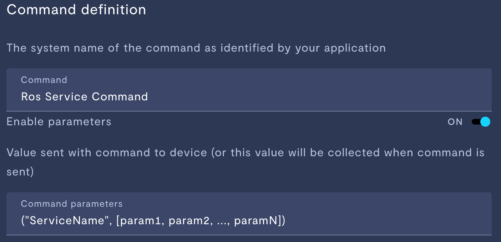

# ROS Service Call Adapter 

## `About`

The ROS service call adapter allows a user to map Formant commands and Formant button presses to different service calls. For example, a user could have a button named <b>Check Robot</b>. In the service call adapter, you could map this button to a service called <b>/robot_status_check</b>. Thus, then the button Check Robot is pressed, it will internally call /robot_status_check. The result of the service call is then posted to a Formant Stream. 

## `Getting Started`

To get started with this adapter, first instal the adapter and make sure that the proper requirements are met via
```console
pip install requirements.txt
```
### `Command Mapping`

Now that the adapters requirements are met, you need to edit the 
`config.json` file to configure commands and buttons that are mapped to 
ROS service calls. To configure a Formant command that is mapped to a 
service call, add the name of the command to the "service-commands" list.
Now that name of the command is listed, the adapter will listen for 
commands sent under this command name. 
While we can now send commands under this name and the adapter will 
receive them, we need to map the command to a service. This is done 
in the command parameters, and looks as follows:


In this case, the name of the Command which we want the adapter to see 
is 'Ros Service Command'. The Name of the service which the command 
talks to is "ServiceName", and the parameters of the command are a 
list, holding param1 through paramN. It is important that they are 
wrapped with and opening and closing parenthesis as shown. 
<br><br><i> *Technical note: </i> The command parameters are send as a 
string to the adapter. Internally, the adapter will safely parse
the passed parameter into a python tuple, where the first element 
is the service name and the second is the service parameters. 
Thus, its important that the command parameters are passed the 
same way as the example image. <br><br>

The command is now mapped to a ROS service call. Issuing the command 
will successfully trigger the service call to be called by the 
adapter.

### `Button Mapping`

Mapping the button to a service call again requires editing the 
`config.json` file. First, open the config.json file. We will
be adding the button-to-service-call mapping under the `button-mapping`
key in the config.json. The first thing we need to do is add a key 
to the `button-mapping` dictionary with the name of the button
that you would like to map. The value associated with this new key 
is a list. The first element of the list needs to be the name of the
service that you would like the button to call. The second element 
of the list needs to be a list containing all the parameters that
are going to be sent to the service. Below is an example of a 
json file that maps a button named `i_am_a_button` to the service
`/robot_status_check`. We are going to assume the service has 
some options we can set as parameters, and thus send 
`True` and `"Option On"` as our parameters.


```json
{
    "service-commands": [
        "rosservice"
    ],
    "button-mapping": {
        "i_am_a_button": [
            "/robot_status_check",
            [
                true,
                "Option On"
            ]
        ]
    }
}
```

That's it. Now a button press to the `i_am_a_button` button will 
map to the service call!

### `Additional Notes`

The command parameters are parsed assuming they have a Python-Like 
syntax. The parser can parse:<br>
* Lists
* Tuples
* Sets
* Integers
* Booleans (True, False) 
* Strings

The parser does not evaluate expressions, so do not pass arithmetic
expressions, as those will cause an error parsing.